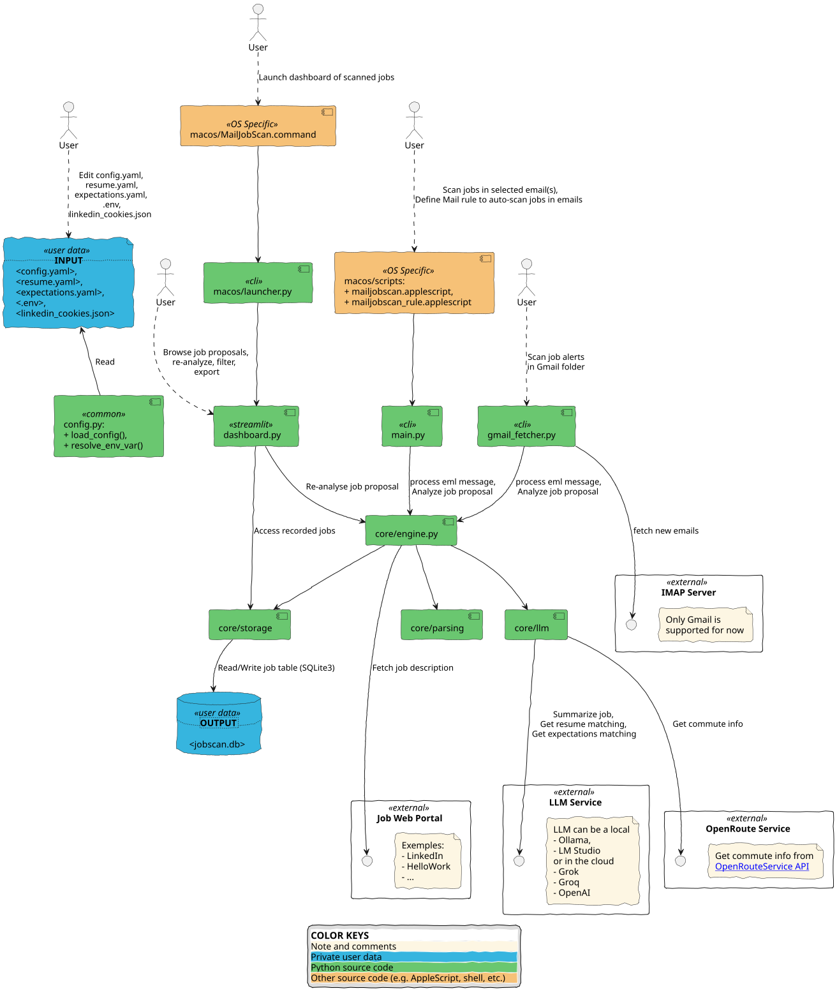
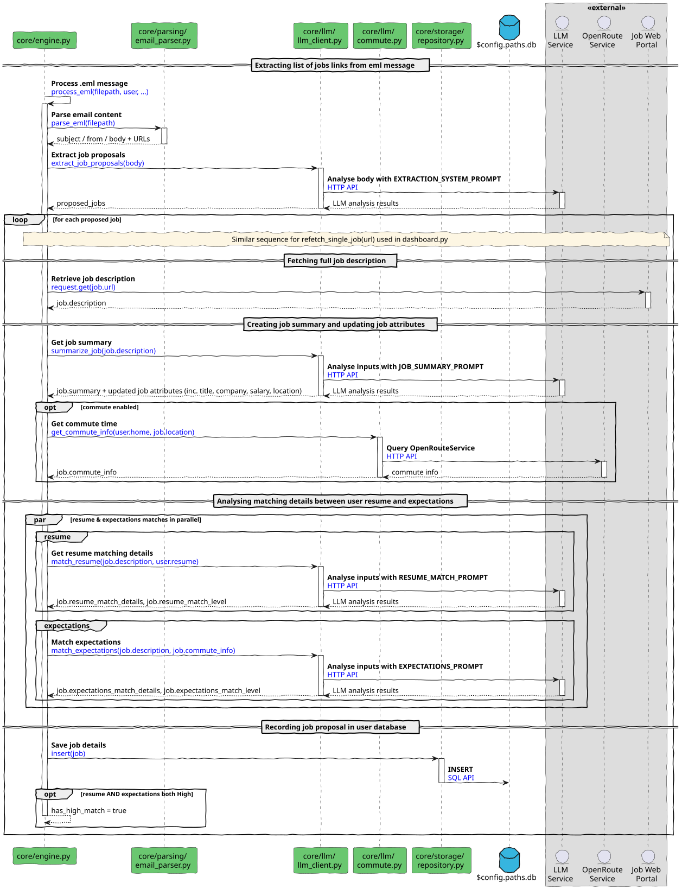
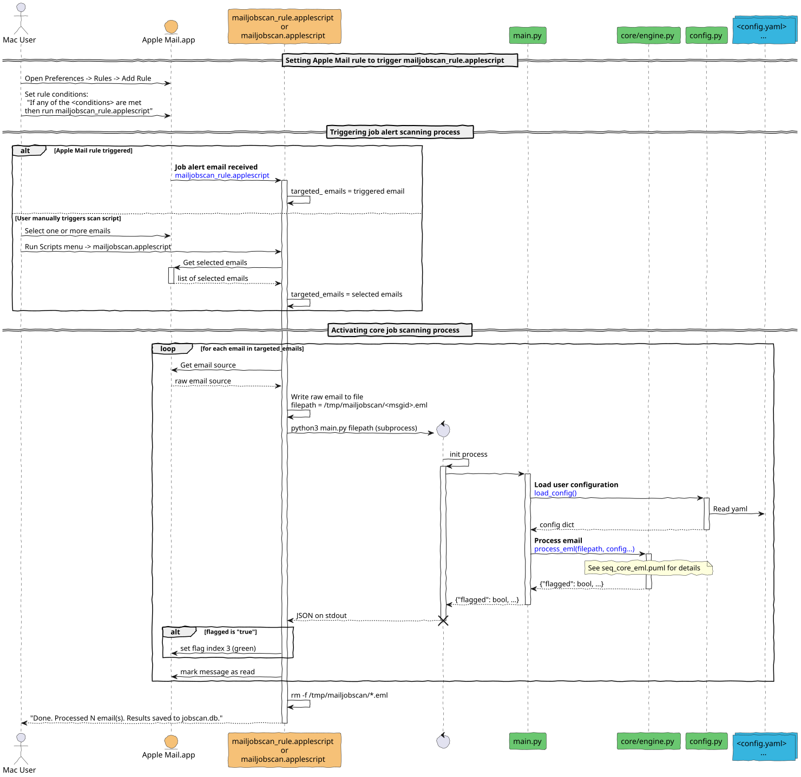
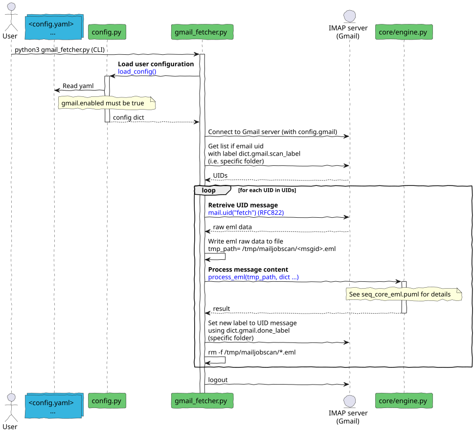
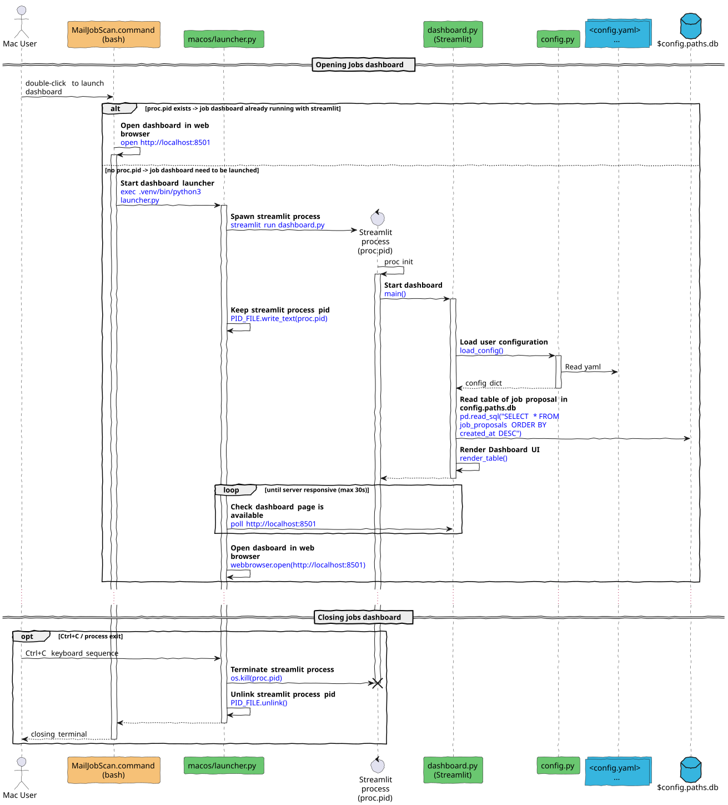
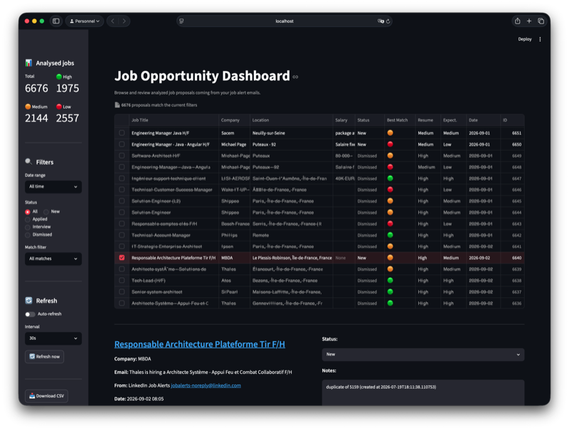
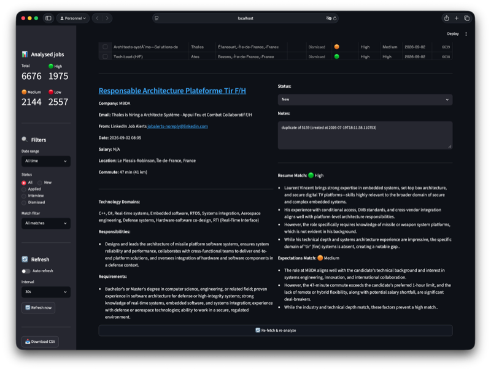

# MailJobScan

Scan job alert emails from Apple Mail, extract job proposals, analyze them against your resume and expectations using a local LLM (Ollama or LMStudio), and flag high-matching opportunities.

Also offer a dashboard view allowing to easy filter, review and annotate all scanned/analyzed jobs.

> **🎯 Author's note** 
> 
> Originally, I have done this project as a POC with following main goals:
> * automatically classified job alerts I received from job portals
> * play with python and LLM
> * learn new stuff like streamlit
> * use AI agent (opencode) as coding assistant 

## Table of Contents

- [MailJobScan](#mailjobscan)
  - [Table of Contents](#table-of-contents)
  - [✨ Features](#-features)
  - [🧩 Architecture](#-architecture)
    - [Static view — components \& dependencies](#static-view--components--dependencies)
    - [Workflow view — triggers \& data ingestion](#workflow-view--triggers--data-ingestion)
      - [Core mail processing sequence](#core-mail-processing-sequence)
      - [AppleScript integration with Mail.app (Mac User Only)](#applescript-integration-with-mailapp-mac-user-only)
      - [Fetching Gmail message in specific folder](#fetching-gmail-message-in-specific-folder)
      - [Opening Streaming dashboard (Mac User Only)](#opening-streaming-dashboard-mac-user-only)
  - [📁 Project Structure](#-project-structure)
  - [📋 Prerequisites](#-prerequisites)
  - [⚙️ Setup](#️-setup)
    - [Install execution environnement](#install-execution-environnement)
    - [Configure user inputs](#configure-user-inputs)
      - [config.yaml](#configyaml)
      - [Extract LinkedIn Cookies](#extract-linkedin-cookies)
  - [🚀 Usage](#-usage)
    - [Automate job scanning](#automate-job-scanning)
      - [Via Apple Mail.app scripts (Mac User Only)](#via-apple-mailapp-scripts-mac-user-only)
      - [Via Gmail IMAP (cross-platform, no macOS required)](#via-gmail-imap-cross-platform-no-macos-required)
    - [Review analyzed jobs](#review-analyzed-jobs)
  - [🔍 Troubleshooting](#-troubleshooting)
    - ["Scripts menu doesn't appear in Mail"](#scripts-menu-doesnt-appear-in-mail)
    - ["Ollama connection refused"](#ollama-connection-refused)
    - ["AppleScript cannot find the project"](#applescript-cannot-find-the-project)
    - ["Python virtual environment not found"](#python-virtual-environment-not-found)
    - ["No job proposals extracted"](#no-job-proposals-extracted)
    - ["Database file not found"](#database-file-not-found)
    - ["URL fetching fails"](#url-fetching-fails)
    - [Gmail IMAP label names must not contain spaces](#gmail-imap-label-names-must-not-contain-spaces)

## ✨ Features

- **One-click from Mail** — select emails and run from the Scripts menu
- **AI extraction** — parses job alert emails into structured proposals (title, URL, company, salary, location)
- **Automated analysis** — fetches each job description, compares it against your resume and expectations
- **Match scoring** — rates each job Low/Medium/High for both skill fit and preference fit
- **Commute calculation** — optional travel time via OpenRouteService, injected into expectations matching
- **Local & private** — runs entirely on your machine via Ollama or LMStudio; no data leaves your computer
- **Swappable AI** — designed so you can switch to OpenAI/Claude by changing one config line
- **Dashboard UI** - Easy access to all job analysis in a nice dashboard 

## 🧩 Architecture

Two complementary views are defined in [`docs/design_views.puml`](docs/design_views.puml) and rendered below.

### Static view — components & dependencies

Layered packages (`entry points` → `core` → external services), the public interfaces each component provides or consumes, and how the code is wired together.



### Workflow view — triggers & data ingestion

How a job scan starts (Apple Mail Scripts menu or Gmail IMAP polling) and how a raw email is turned into stored, scored job proposals. The workflow is broken into four sequence diagrams below.

#### Core mail processing sequence

This is the core pipeline shared by every upper trigger mechanism to process mail job scan.
An `.eml` file is parsed into email fields, the body is sent to the LLM to extract job proposals. Once complete job description is extracted from job portal, each proposal is then enriched with following actions:
- Summarize job description summary, 
- Optionally compute commute time via OpenRouteService,
- Run resume and expectations matching analysis in parallel,
- Persist the result to the database.
- This is the same flow behind `main.py`, `gmail_fetcher.py`, and the dashboard's *Re-fetch & re-analyze*.



#### AppleScript integration with Mail.app (Mac User Only)

You can either set an Apple Mail rule (`mailjobscan_rule.applescript`) to auto-trigger when a job-alert email arrives, or select emails and run `mailjobscan.applescript` from the Scripts menu.
Either way each email is exported to a temp `.eml`, `main.py` is launched as a subprocess to run the core pipeline, and the returned `flagged` value decides whether a green flag is set in Mail.



#### Fetching Gmail message in specific folder 

Cross-platform path that needs neither macOS nor Apple Mail.
`gmail_fetcher.py` connects to Gmail over IMAP, selects your `scan_label` folder, and for each message exports a temp `.eml` and delegates to the same `process_eml()` core pipeline.
Already-processed messages are skipped via their `Message-ID`, and each processed message is moved to the `done_label` folder.



#### Opening Streaming dashboard (Mac User Only)

Double-clicking `MailJobScan.command` runs `macos/launcher.py`, which starts a Streamlit server for `dashboard.py`, opens the browser at `http://localhost:8501`, and tracks the PID so accidental duplicates are killed.
From the dashboard you can browse, filter, and export results, or re-analyze a single job.



The dashboard itself is not macOS-specific. On any platform you can start it directly with `streamlit run dashboard.py`, and scan emails with `python gmail_fetcher.py`. The `MailJobScan.command` / `launcher.py` pair is only a convenience wrapper for macOS.

## 📁 Project Structure

Root-level layout (folders only shown one level deep):

```
MailJobScan/
├── config.yaml                   # Active config — symlink to __private__/myconfig.yaml
├── config.example.yaml           # Documented config template (copy to __private__/)
├── config.py                     # Shared leaf: load_config(), env resolution, LinkedIn cookies
├── main.py                       # CLI entry point used by AppleScript (python main.py <eml>)
├── gmail_fetcher.py              # Gmail IMAP fetcher (cross-platform; --daemon to poll)
├── dashboard.py                  # Streamlit dashboard app
├── core/                         # Layered core packages (parsing → llm → storage), orchestrated by engine.py
├── MacOS/                        # macOS glue: Mail AppleScripts, dashboard launcher, install.sh
├── docs/                         # Documentation & PlantUML architecture diagrams
├── requirements.txt              # List of required Python module
├── README.md                     # This documentation
├── resume.example.md             # User resume model (for LLM analysis)
├── expectations.example.md       # User expectations model (for LLM analysis) 
├── linkedin_cookies.Example.json # Sample cookies allowing to access LinkedIn page without re-authentication
```

> **Note on profile files:** your CV (`myResume.md`), expectations (`myExpectations.md`),
> linkedin cookies, database, and personal config live in the gitignored
> `__private__/` folder. Templates to copy are at the repo root
> (`resume.exemple.md`, `expectations.example.md`, `linledin_cookies.example.json`).

## 📋 Prerequisites

- Python 3.11+
- **(Optional)** macOS (Apple Mail + Scripts menu)
- **(Optional)** [Ollama](https://ollama.com) installed (`brew install ollama`) with a model pulled (`ollama pull llama3.2`)
- **(Optional)** [LM Studio](https://lmstudio.ai) — alternative to Ollama; runs a local LLM server on `http://localhost:1234/v1` with no separate model-pull step

## ⚙️ Setup

### Install execution environnement
```bash
# 1. Navigate to the project
cd MailJobScan

# 2. Create virtual environment and install dependencies
python3 -m venv .venv
source .venv/bin/activate
pip install -r requirements.txt

# 3. Provide your personal profiles
#    data/cv.md and data/expectations.md are symlinks pointing to
#    files inside data/private/. Create your own files there:
#
#      data/private/your_resume.txt       # Your CV / experience
#      data/private/your_expectations.md  # Your job preferences
#
#    The symlinks resolve automatically when the target files exist.
#    See data/templates/ for demo examples to copy.

# 4. Verify Ollama is running with the configured model
ollama serve          # start Ollama if not already running
ollama list           # should show llama3.2 (or the model in config.yaml)

# 5. Install the Mail Script
bash MacOS/Scripts/install.sh

#    This compiles the AppleScript and copies it to
#    ~/Library/Scripts/Applications/Mail/mailjobscan.scpt
#    If you moved the project, update projectDir in MacOS/Scripts/mailjobscan.applescript first.
```

### Configure user inputs

Following items need to be properly configured:
1. config.yaml
2. resume and expectations data
3. linkedIn cookies
4. specific environment variables

> **Note:** User can use `__private__` folder already added to `.gitignore` to store all these custom inputs.

#### config.yaml

Copy `config.example.yaml` to `__private__/myconfig.yaml` and edit it.
The symlink `config.yaml` at the project root already points there, so
no further wiring is needed.

Key sections to fill in:

| Section | What to set |
|---------|-------------|
| `llm`   | `provider` (`ollama` or `lmstudio`), `endpoint` (e.g. `http://localhost:11434` for Ollama, `http://localhost:1234` for LM Studio), `model` name, optional `options` (temperature, context length) |
| `paths` | Paths to your CV, expectations, database, and LinkedIn cookies — all under `__private__/` |
| `gmail` | `enabled`, `email`, `app_password` (or `${GMAIL_APP_PASSWORD}` env var), `scan_label`, `done_label`, `poll_interval_seconds` — only needed if you use Gmail IMAP |
| `commute` | `enabled`, your `home` address, OpenRouteService `api_key`, and `profile` (e.g. `driving`, `cycling`, `walking`) — only needed if you want commute estimates |

See `config.example.yaml` for all available keys and defaults.

#### Extract LinkedIn Cookies

Scanning job process required LinkedIn login cookies to access LinkedIn job description.
Cookies can be grabbed from any modern HTML browser thru developer mode / web inspector view once properly logged into [linkedin.com](https://www.linkedin.com).

Example below for Safari (Mac User):

1. Open Safari and log into [linkedin.com](https://www.linkedin.com)
2. Enable Developer Tools: Safari → Settings → Advanced → check *"Show Develop menu in menu bar"*
3. Open Web Inspector: Develop → Show Web Inspector (or `⌥⌘I`)
4. Go to the Storage tab → expand *Cookies* → select `www.linkedin.com`
5. Find these two cookies and copy their values:

   | Cookie | What to look for |
   |--------|------------------|
   | `li_at` | Long base64 string (300+ chars) — the OAuth2 session token |
   | `JSESSIONID` | Short string like `ajax:123456789` — the CSRF token |

6. Create a custom version of `linkedin_cookies.example.json` with the value from web inspector and make sure `paths.linkedin_cookies` config attribute is well pointing the file. 
7. Verify by running the dashboard and clicking *Re-fetch & re-analyze* on any LinkedIn proposal — the error should clear and match results should appear.

> **Note:** If `JSESSIONID` doesn't appear in Safari's Storage tab, try first with only `li_at` — it may be sufficient for GET requests. Cookies expire approximately once per year (or when you log out); update the file when they do.

## 🚀 Usage

### Automate job scanning

#### Via Apple Mail.app scripts (Mac User Only)

**Use case 1: Analyse select emails**

> **Tip:** The Scripts menu (wrench icon) only appears if at least one script is installed in `~/Library/Scripts/Applications/Mail/` (the install script handles this). If it is still hidden, open **Script Editor → Preferences → General** and check **"Show Script menu in menu bar"**.

1. Open **Mail.app**
2. Select one or more job alert emails
3. Click the **Scripts menu** (wrench icon in the menu bar) → **mailjobscan**
4. Wait for the "Done" dialog — each email takes ~30-60 seconds depending on the number of proposals
5. Emails with **High** match level are flagged with a yellow flag in Mail
6. All results are logged to `jobscan.db`

**Use case 2: Automatic mail rule**

You can have Mail.app automatically process incoming job-alert emails by creating a mail rule:

1. Open **Mail.app → Settings → Rules → Add Rule**
2. Give the rule a name (e.g. `MailJobScan`)
3. Set the condition to match your job-alert emails (e.g. *From* contains `jobs-noreply@linkedin.com`, or *Subject* contains `offres d'emploi`)
4. Set the action to **Run Script** → find `mailjobscan` under `~/Library/Scripts/Applications/Mail/`
5. Click **OK** to save

From then on, every new email that matches the rule is automatically exported to a `.eml` and processed through the LLM pipeline. Matched emails are marked as read; high-match emails get a green flag in Mail.

> **Note:** The `mailjobscan_rule.applescript` uses the same `projectDir` as the main script — if you moved the project, update that path first (see [Troubleshooting](#applescript-cannot-find-the-project)).

#### Via Gmail IMAP (cross-platform, no macOS required)

`gmail_fetcher` connects directly to your Gmail inbox via IMAP, finds job alert emails in a configurable label, processes them through the same LLM pipeline, and marks them done — no Apple Mail or macOS needed.

**Setup:**

1. Enable 2-Factor Authentication on your Google account
2. Generate an App Password at https://myaccount.google.com/apppasswords
3. Edit `config.yaml` and make sure section `gmail` is well configured (see example below).

```yaml
gmail:
  enabled: true
  email: "your.email@gmail.com"
  app_password: "abcd efgh ijkl mnop"   # 16-char App Password
  scan_label: "JobAlerts"   # no spaces — see Troubleshooting
  done_label: "ScannedJobs" # must NOT be a child of scan_label
  poll_interval_seconds: 300             # how often to check (daemon mode)
```

> **Important — Label hierarchy:** `done_label` must **not** be a child of
> `scan_label` (e.g. `Job Alerts/Done`). Gmail IMAP `SELECT` returns emails
> with the selected label **and all descendant labels**, so a child `done_label`
> would be included in every scan. Use a sibling path instead (e.g.
> `scan_label: "Job Alerts"` / `done_label: "JobScan/Done"`).

> **Tip:** You can also store the App Password as an environment variable:
> `export GMAIL_APP_PASSWORD="abcd efgh ijkl mnop"` and reference it in
> `config.yaml` as `app_password: "${GMAIL_APP_PASSWORD}"`.

**Run:**

```bash
source .venv/bin/activate

# Single scan — processes all unscanned emails and exits
python gmail_fetcher.py

# Daemon mode — polls Gmail every N seconds (from config)
python gmail_fetcher.py --daemon
```

### Review analyzed jobs

As mentioned in [Dashboard with Streamlit](#dashboard-with-streamlit), [Streamlit](https://streamlit.io) with `dashboard.py` provides a nice view allowing to browse, filter and review all the analyzed jobs. 

**Mac User** can directly double-click **`MacOS/MailJobScan.command`** in the project folder to launch the dashboard. This will opens terminal window showing Streamlit logs in realtime and opens automatically the dashboard at [http://localhost:8501](http://localhost:8501)

> **Tip:** Drag `macos/MailJobScan.command` to your Dock for one-click access.

Other users can access the dashboard view with the following terminal commands.

```bash
source .venv/bin/activate
streamlit run dashboard.py
```
Opens at `http://localhost:8501` in your browser.

The dashboard have following features:
- **Date range filter** — last 7/30/90 days or custom period
- **Match filter** — show only high matches, medium+, or low matches
- **Color-coded table** — green (High), yellow (Medium), red (Low)
- **Detail panel** — click any proposal to see full match summaries, commute info, URL, salary, and location
- **CSV export** — download filtered results

<table>
<tr>
<td align="center">
  <br>
  <em>Job list view — color-coded match levels with date and filter controls</em>
</td>
<td align="center">
  <br>
  <em>Job detail view — full match summaries, commute info, and re-fetch controls</em>
</td>
</tr>
</table>

## 🔍 Troubleshooting

### "Scripts menu doesn't appear in Mail"

Restart Mail.app. The Scripts menu (wrench icon) appears between the Window and Help menus if at least one script is in `~/Library/Scripts/Applications/Mail/`. If it still doesn't appear, try:

1. Open **Script Editor** → Preferences → **General** → check **"Show Script menu in menu bar"**
2. The icon now appears in the menu bar — select **Mail** from the dropdown

### "Ollama connection refused"

Ensure Ollama is running:
```bash
ollama serve
```

### "AppleScript cannot find the project"

If you moved the project directory, update `projectDir` at the top of `MacOS/Scripts/mailjobscan.applescript`, then recompile and reinstall:
```bash
bash macos/Scripts/install.sh
```

### "Python virtual environment not found"

Run from the project root:
```bash
python3 -m venv .venv
source .venv/bin/activate
pip install -r requirements.txt
```

### "No job proposals extracted"

- Check that `ollama serve` is running
- Verify the model in `config.yaml` matches `ollama list`
- Try a larger model — `llama3.2` (3B) can miss items in complex emails; `qwen2.5:7b` or `mistral:7b` performs better

### "Database file not found"

The `jobscan.db` file is created automatically in the project root on first run. If you see errors, verify the project root has write permissions.

### "URL fetching fails"

Some job portals block automated requests. The tool falls back from `trafilatura` to `requests` with a browser User-Agent, but very aggressive anti-scraping sites may still block it. Check the error field in the database:
```bash
# if "jobscan.db" is define in config.yaml as paths.db attribute 
sqlite3 jobscan.db "SELECT job_title, error FROM job_proposals WHERE error IS NOT NULL;"
```

### Gmail IMAP label names must not contain spaces

Python's `imaplib` does not properly quote IMAP command arguments. When `scan_label` or `done_label` contains spaces (e.g. `Recherche Emploi/Job Alerts`), the IMAP `COPY` and `STORE` commands are sent unquoted, which causes the Gmail server to reject them with `BAD [Could not parse command]`.

**Workaround:** use label names without spaces. Replace spaces with CamelCase or hyphens:

```yaml
gmail:
  scan_label: "JobAlerts"       # no spaces
  done_label: "ScannedJobs"     # no spaces
```

Then rename the labels in Gmail to match (Gmail → Settings → Labels).

This also applies to `done_label` — the label move after processing will fail silently if it contains spaces.
